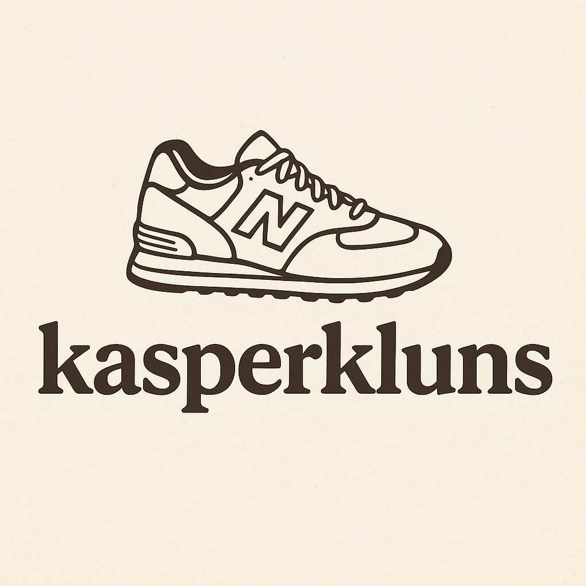

# KasperKluns Inventory App



## 🧾 Overview
KasperKluns is my personal inventory management application designed for small business specializing in second-hand clothing and footwear. The app helps in tracking stock, managing sales, and organizing products efficiently.

## 🛠️ Features
- Add, edit, and delete product listings
- Track product quantities and sales
- Categorize products by type, size, and condition
- Search and filter products easily
- Generate sales reports

## 🚀 Installation
Clone the repository:
```bash
git clone https://github.com/kappertherapper/kasperkluns.git
